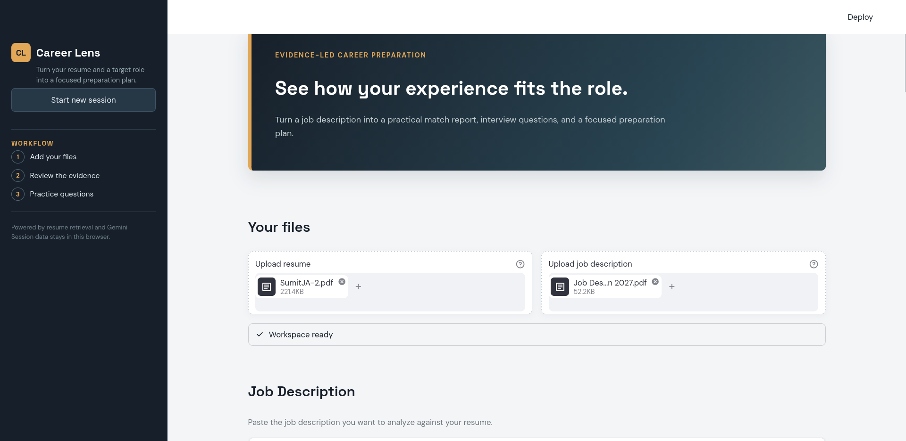
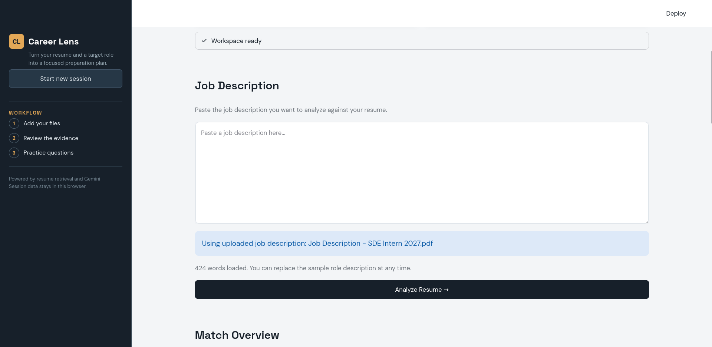
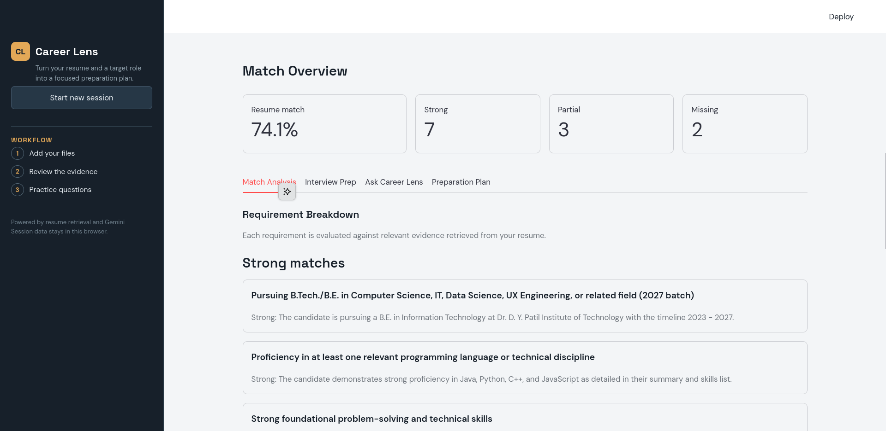
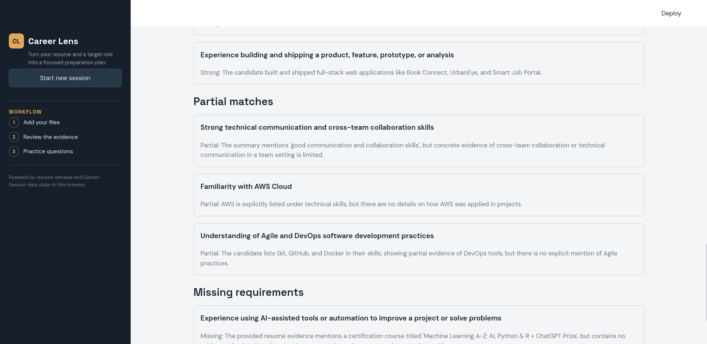
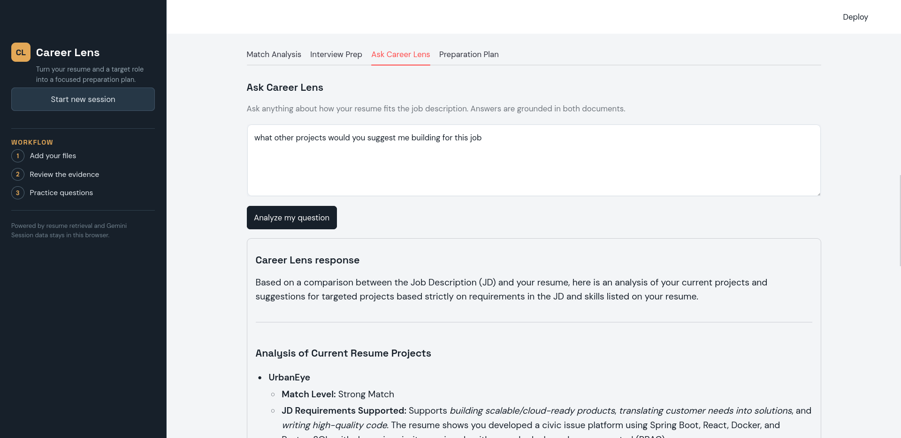
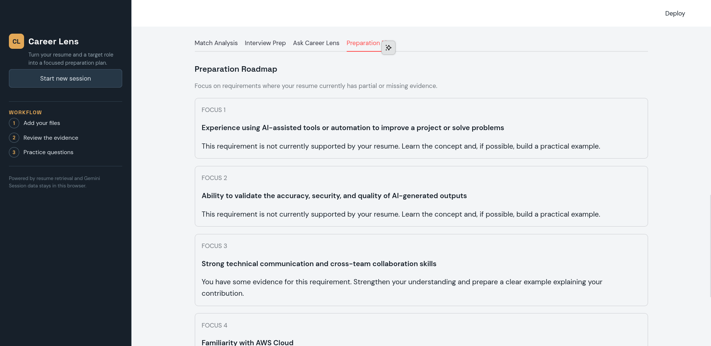
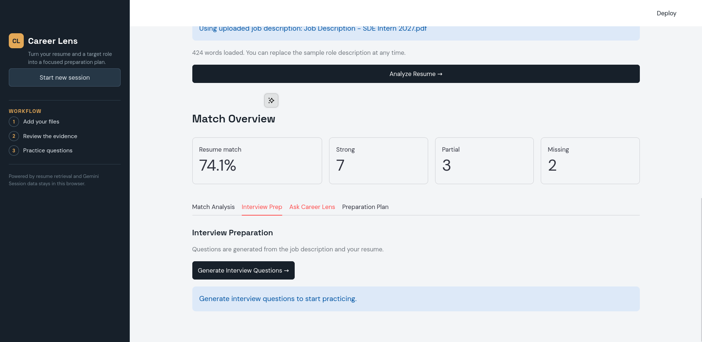

# Career Lens

Career Lens is a retrieval-augmented resume analysis application created by **Sumit Anandrao Kapse**. It compares a candidate's resume with a job description and turns the results into a match report, interview preparation, and a focused preparation plan.

## Features

- Upload a resume as a PDF.
- Upload a job description as a PDF or TXT file, or paste it into the app.
- Extract job requirements with Gemini.
- Retrieve relevant resume evidence using Sentence Transformers and FAISS.
- Classify requirements as strong, partial, or missing.
- Calculate a weighted resume-to-job match score.
- Generate personalized interview questions.
- Generate resume-grounded interview answers.
- Ask custom questions about the relationship between the resume and job description in **Ask Career Lens**.
- Keep uploaded resume indexing temporary without overwriting the existing vector store.

## How It Works

1. The resume is split into meaningful sections and chunks.
2. `all-MiniLM-L6-v2` creates embeddings for the resume chunks.
3. FAISS retrieves the most relevant resume evidence for each requirement or question.
4. Gemini extracts requirements, evaluates evidence, and generates explanations.
5. Python calculates the final weighted match score.

## Project Structure

```text
.
├── app.py                         # Streamlit user interface
├── ingest.py                      # Build the resume FAISS index
├── jd_ingest.py                   # Build the job-description index
├── requirements.txt               # Python dependencies
├── data/
│   ├── job_description.txt        # Optional default JD source
│   └── resume.pdf                 # Optional default resume source
├── rag/
│   ├── interviewer.py             # Interview and custom-question logic
│   ├── matcher.py                 # Requirement matching and scoring
│   └── retrieval.py               # FAISS resume retrieval
└── vector_store/
	├── resume.index               # Resume FAISS index
	├── metadata.json              # Resume chunk metadata
	├── jd.index                   # JD FAISS index
	└── jd_metadata.json           # JD chunk metadata
```

## Requirements

- Python 3.10 or newer
- A Gemini API key
- Internet access on the first run to download the embedding model

## Installation

Create and activate a virtual environment:

```bash
python3 -m venv venv
source venv/bin/activate
```

Install dependencies:

```bash
python -m pip install -r requirements.txt
```

Create a `.env` file in the project root:

```env
GEMINI_API_KEY=your_new_gemini_api_key
GEMINI_MODEL=gemini-3.6-flash
```

Never commit `.env` or expose the API key publicly. The project `.gitignore` already excludes `.env`.

## Run the Application

```bash
source venv/bin/activate
streamlit run app.py --server.fileWatcherType none
```

Open the local URL printed by Streamlit, usually:

```text
http://localhost:8501
```

Then:

1. Upload your resume PDF.
2. Upload a job description PDF/TXT or paste the JD.
3. Click **Analyze Resume**.
4. Review the match score and requirement evidence.
5. Use **Ask Career Lens** for questions such as:

   ```text
   Which projects from my resume best match this job description?
   ```

6. Use **Interview Prep** to generate and practice interview questions.

## Screenshots

### Upload Resume and Job Description



### Match Overview



### Requirement Breakdown



### Interview Preparation



### Ask Career Lens



### Preparation Roadmap



### Responsive Interface



## Rebuild the Stored Indexes

The Streamlit app can use uploaded files directly. The ingestion scripts are only needed when rebuilding the default files in `vector_store/`.

To rebuild the resume index, place the source file at `data/resume.pdf` and run:

```bash
python ingest.py
```

To rebuild the job-description index, place the source file at `data/job_description.txt` and run:

```bash
python jd_ingest.py
```

These scripts generate FAISS indexes and JSON metadata under `vector_store/`.

## Troubleshooting

### Gemini 403 permission denied

This means the API key's Google project or selected model is not permitted. Check that:

- The key belongs to the intended Google AI Studio or Google Cloud project.
- The Generative Language API is enabled.
- The key is active and not restricted incorrectly.
- The selected model is available to that project.

You can list models without printing the key:

```bash
set -a
source .env
set +a
curl -s "https://generativelanguage.googleapis.com/v1beta/models?key=$GEMINI_API_KEY"
```

### Gemini 429 quota exceeded

The free-tier request quota has been reached. Wait for the retry window, check usage, or use another project with available quota. The application preserves previous results when a request fails.

### Resume model loads repeatedly

The embedding model is cached while the Streamlit process is running. Restarting the process can load it again, but it is not downloaded again once it exists in the local Hugging Face cache.

### PDF text is missing

The resume parser expects selectable text. Image-only scanned PDFs may need OCR before uploading.

## Security

- Keep API keys only in `.env` or environment variables.
- Rotate any key that has been shared in screenshots, chat, logs, or repositories.
- Uploaded files are processed for the current Streamlit session and are not written to the project vector store.

## Author

**Sumit Anandrao Kapse**  
B.E. Information Technology  
Dr. D. Y. Patil Institute of Technology  
Email: sumitkapse27190@gmail.com
